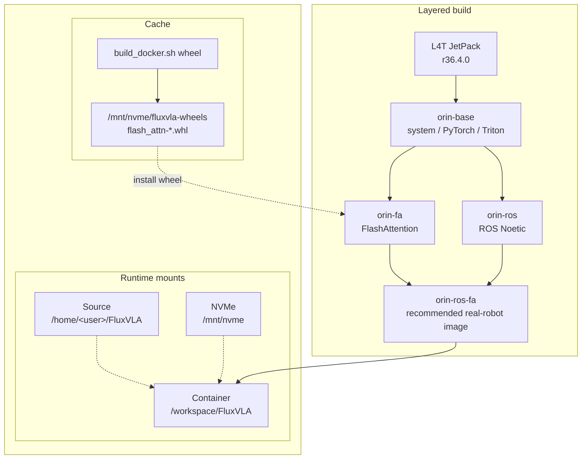

# Jetson Orin Docker and Runtime Test Guide

## 1. Recommended Path

Use the Orin host as the stable runtime base. The host should own JetPack, Docker, NVMe storage, source code, and model data. Put the FluxVLA Python, PyTorch, Triton, FlashAttention, and ROS Noetic runtime environment inside Docker images whenever possible.

Recommended source path:

```bash
/home/<user>/FluxVLA
```

Recommended data and model path:

```bash
/mnt/nvme
```

Docker builds are managed by one entry point:

```bash
docker/build_docker.sh
```

The default build creates the recommended layered images:

- `fluxvla:orin-base` without flash attention and ROS 1
- `fluxvla:orin-fa` with flash attention
- `fluxvla:orin-ros` with ROS 1 Noetic
- `fluxvla:orin-ros-fa`

This avoids recompiling FlashAttention and ROS together every time.

For real-robot inference, prefer:

```text
fluxvla:orin-ros-fa
```

For non-ROS inference or benchmark tests, use:

```text
fluxvla:orin-fa
```

## 2. Host Prechecks

After logging into the Orin, first check the system, NVMe, and Docker state:

```bash
cat /etc/nv_tegra_release
nvcc --version
df -h /mnt/nvme
docker --version
docker info | grep -i runtime || true
docker ps
```

If `docker ps` requires `sudo`, fix Docker user permissions first:

```bash
sudo usermod -aG docker "$USER"
newgrp docker
docker ps
```

Put the Docker image store on NVMe to avoid filling the system disk with image layers:

```bash
docker info | grep "Docker Root Dir"
```

If it is still `/var/lib/docker`, migrate it before the first large build:

```bash
sudo apt update
sudo apt install -y rsync
sudo systemctl stop docker
sudo mkdir -p /mnt/nvme/docker
# sudo apt install rsync
sudo rsync -aHAX /var/lib/docker/ /mnt/nvme/docker/

sudo mkdir -p /etc/docker
sudo tee /etc/docker/daemon.json <<'EOF'
{
  "data-root": "/mnt/nvme/docker"
}
EOF

sudo systemctl start docker
docker info | grep "Docker Root Dir"
```

Expected output:

```text
Docker Root Dir: /mnt/nvme/docker
```

## 3. Build Images

Run all commands from the repository root by default:

```bash
cd /home/<user>/FluxVLA
```

Use the unified entry point:

```bash
docker/build_docker.sh
```

The default target is `all`, which builds layers in this order: `base -> flash-attn wheel -> fa -> ros -> ros-fa`. The ROS layer uses China mirrors by default. To disable China mirrors, set `FLUXVLA_USE_CN_MIRRORS=0` explicitly.

Build outputs:

```text
fluxvla:orin-base
fluxvla:orin-ros-fa
```

The FlashAttention wheel is written to:

```text
/mnt/nvme/fluxvla-wheels
```

If you need to rebuild the FlashAttention SM87 wheel:

```bash
docker/build_docker.sh wheel
docker/build_docker.sh fa
docker/build_docker.sh ros-fa
```

If you need to rebuild the ROS layer:

```bash
docker/build_docker.sh ros
docker/build_docker.sh ros-fa
```

FluxVLA source code is mounted at runtime. You do not need to rebuild the image or container after source edits. `docker/run_docker.sh` bind-mounts the current source tree to `/workspace/FluxVLA`. Editing the local Orin source, such as `/workspace/FluxVLA`, updates the code seen inside the container.

The layer relationship is:



View full help:

```bash
docker/build_docker.sh --help
```

## 4. Enter the Container

Use the repository script:

```bash
cd /home/<user>/FluxVLA
docker/run_docker.sh
```

Specify an image:

```bash
FLUXVLA_IMAGE=fluxvla:orin-ros-fa docker/run_docker.sh
```

Run a command directly inside the container:

```bash
FLUXVLA_IMAGE=fluxvla:orin-ros-fa docker/run_docker.sh \
  python3 -c "import torch; print(torch.cuda.is_available(), torch.version.cuda)"
```

`docker/run_docker.sh` fills in runtime arguments, environment variables, and common mounts:

| Category                       | Automatic handling                                                                                                                 |
| ------------------------------ | ---------------------------------------------------------------------------------------------------------------------------------- |
| Docker runtime args            | `--runtime=nvidia`, `--network=host`, `--ipc=host`, `--shm-size=16g`                                                               |
| Python / inference environment | `PYTHONPATH=/workspace/FluxVLA`, `WANDB_MODE=disabled`                                                                             |
| Attention configuration        | `ATTN_IMPLEMENTATION` defaults to `flash_attention_2`; `TRANSFORMERS_ATTN_IMPLEMENTATION` follows `ATTN_IMPLEMENTATION` by default |
| Directory mounts               | Repository root mounted to `/workspace/FluxVLA`                                                                                    |
| Robotiq message package        | If `~/robotiq_pkg/robotiq` exists, it is mounted read-only to `/opt/ros/noetic/lib/python3/dist-packages/robotiq`                  |
| ROS network variables          | If the host has `ROS_MASTER_URI`, `ROS_IP`, or `ROS_HOSTNAME`, they are passed through to the container                            |

Temporarily fall back to eager attention:

```bash
ATTN_IMPLEMENTATION=eager TRANSFORMERS_ATTN_IMPLEMENTATION=eager \
  FLUXVLA_IMAGE=fluxvla:orin-ros-fa docker/run_docker.sh
```

Confirm that host source code is really mounted into the container:

```bash
# Host
cd /home/<user>/FluxVLA
echo "MARK_$(date +%s)" > _mount_probe.txt
cat _mount_probe.txt

# Inside the container
cat /workspace/FluxVLA/_mount_probe.txt
```

Matching content means the source tree you are editing is the one mounted inside the container. Remove the probe after validation:

```bash
rm -f _mount_probe.txt /workspace/FluxVLA/_mount_probe.txt
```

## 5. Basic Acceptance Tests

### 5.1 Image and Container Basics

```bash
cd /home/<user>/FluxVLA
docker images fluxvla

FLUXVLA_IMAGE=fluxvla:orin-ros-fa docker/run_docker.sh \
  bash -lc 'pwd; python3 --version; echo "$PYTHONPATH"; ls /mnt/nvme >/dev/null && echo NVME_OK'
```

### 5.2 PyTorch / CUDA

```bash
FLUXVLA_IMAGE=fluxvla:orin-ros-fa docker/run_docker.sh python3 - <<'PY'
import torch
print('torch:', torch.__version__)
print('cuda_available:', torch.cuda.is_available())
print('torch_cuda:', torch.version.cuda)
if torch.cuda.is_available():
    print('device:', torch.cuda.get_device_name(0))
PY
```

Pass criteria: `cuda_available: True`, and the device name shows the Orin GPU.

### 5.3 Triton / FlashAttention / FluxVLA

```bash
FLUXVLA_IMAGE=fluxvla:orin-ros-fa docker/run_docker.sh python3 - <<'PY'
import triton
print('triton:', triton.__version__)

import flash_attn
print('flash_attn:', flash_attn.__version__)

import fluxvla
print('fluxvla: OK')
PY
```

If you are using `fluxvla:orin-base` or another image without FA, `flash_attn` failing is expected. In that case, use `ATTN_IMPLEMENTATION=eager` for the basic path.

### 5.4 ROS Python Environment

```bash
FLUXVLA_IMAGE=fluxvla:orin-ros-fa docker/run_docker.sh \
  python3 -c "import rospy, cv_bridge; print('ROS PY OK')"
```

Validate the custom Robotiq message package:

```bash
FLUXVLA_IMAGE=fluxvla:orin-ros-fa docker/run_docker.sh \
  bash -lc 'source /opt/ros/noetic/setup.bash && python3 -c "from robotiq.msg import StampedFloat32; print(StampedFloat32._type)"'
```

Pass criteria: output is `robotiq/StampedFloat32`.

### 5.5 GR00T Checkpoint Test

First confirm that the checkpoint file can be read by `torch.load`:

```bash
CKPT=.../gr00t_eagle_3b_ur3_full_finetune_orin/checkpoints/step-000100-epoch-00-loss=1.2629.pt

FLUXVLA_IMAGE=fluxvla:orin-ros-fa docker/run_docker.sh \
  python3 - <<PY
import torch
p = '${CKPT}'
obj = torch.load(p, map_location='cpu')
print(type(obj).__name__)
print(sorted(obj.keys())[:20] if isinstance(obj, dict) else 'non-dict')
PY
```

Then run one short inference:

```bash
FLUXVLA_IMAGE=fluxvla:orin-ros-fa docker/run_docker.sh \
  python3 scripts/test_gr00t_with_embodiment.py \
    --config configs/gr00t/gr00t_eagle_3b_ur3_full_finetune.py \
    --ckpt "$CKPT" \
    --warmup 0 \
    --predict-runs 1
```

Pass criteria: `predict_action output shape` appears and the command exits normally.

### 5.6 GR00T Baseline / Accelerated 100-Run Benchmark

This benchmark uses the same script to test both the baseline and accelerated paths. Dummy language tokens construct image placeholder tokens for two image streams, so visual features are inserted into the language sequence and the benchmark matches the real inference path more closely.

| Variant     | Config source         | Component path                                       | Description                                |
| ----------- | --------------------- | ---------------------------------------------------- | ------------------------------------------ |
| baseline    | `cfg.model`           | `EagleBackbone + FlowMatchingHead`                   | Normal inference path, used as the control |
| accelerated | `cfg.inference_model` | `EagleInferenceBackbone + FlowMatchingInferenceHead` | Triton / CUDA Graph accelerated path       |

Set the same checkpoint first:

```bash
CKPT=../gr00t_eagle_3b_ur3_full_finetune_orin/checkpoints/step-006000-epoch-00-loss=0.1157.safetensors
```

Baseline:

```bash
FLUXVLA_IMAGE=fluxvla:orin-ros-fa docker/run_docker.sh \
  python3 test/test_models/test-gr00t-100times.py \
    --variant baseline \
    --config configs/gr00t/gr00t_eagle_3b_ur3_full_finetune.py \
    --ckpt "$CKPT" \
    --warmup 5 \
    --predict-runs 100
```

Accelerated:

```bash
FLUXVLA_IMAGE=fluxvla:orin-ros-fa docker/run_docker.sh \
  python3 test/test_models/test-gr00t-100times.py \
    --variant accelerated \
    --config configs/gr00t/gr00t_eagle_3b_ur3_full_finetune.py \
    --ckpt "$CKPT" \
    --warmup 5 \
    --predict-runs 100
```

Expected key output:

```text
Head: FlowMatchingInferenceHead
Backbone: EagleInferenceBackbone
image_token_id=151669, image_token_count=512
predict_action output shape: (1, 32, 7)
latency_ms: ... median=about 150-155 ms ...
OK
```

`image_token_count=512` means two image streams, 256 image tokens each, have been inserted into `lang_tokens`, so visual embeddings participate in the following attention computation. If this value is 0, the benchmark input has no image tokens and the result does not represent the real vision-language inference path.

Suggested result table:

| Variant     | Head                      | Backbone               | Median latency | Frequency |
| ----------- | ------------------------- | ---------------------- | -------------- | --------- |
| baseline    | FlowMatchingHead          | EagleBackbone          | 256 ms         | 3.9 Hz    |
| accelerated | FlowMatchingInferenceHead | EagleInferenceBackbone | 150-155 ms     | 6.5 Hz    |

## 7. Issues and Troubleshooting Notes

Recent debugging conclusions, checkpoint conversion suggestions, Q&A, the minimum acceptance checklist, and source documents have been split into a separate document:

```text
docs/orin_docker_runtime_issue_zh-CN.md
```
