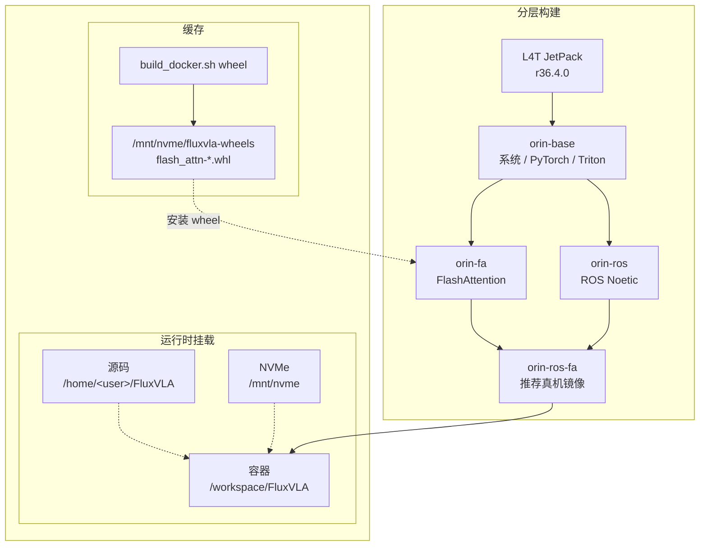

# Jetson Orin Docker 与运行测试指南

> 日期：2026-06-22  
> 适用范围：Jetson AGX Orin / JetPack 6.2 / L4T R36.4.x / FluxVLA Docker 运行环境  
> 前置条件：Orin 已按刷机文档完成 JetPack 初始化，并已验证 CUDA、Docker 与 NVIDIA runtime 可用。

本文覆盖刷机之后的 FluxVLA Docker 构建、容器运行、基础测试、ROS/UR3 真机测试和最近调试得到的 Q&A。

## 1. 推荐路线

推荐把 Orin 宿主机当作稳定运行底座：宿主机负责 JetPack、Docker、NVMe、源码和模型数据；FluxVLA 的 Python、PyTorch、Triton、FlashAttention、ROS Noetic 运行环境优先放在 Docker 镜像内。

推荐源码路径：

```bash
/home/<user>/FluxVLA
```

推荐数据和模型路径：

```bash
/mnt/nvme
```

当前统一由一个入口管理 Docker 构建：

```bash
docker/build_docker.sh
```

默认构建推荐的新分层镜像：
- `fluxvla:orin-base`  w/o flash attention & ros1
- `fluxvla:orin-fa`  with flash attention
- `fluxvla:orin-ros`  with ros1-noetic
- `fluxvla:orin-ros-fa`
避免 FlashAttention 和 ROS 每次一起重编。

真机推理优先使用：

```text
fluxvla:orin-ros-fa
```

只做非 ROS 的推理或测速 benchmark 时可以使用：

```text
fluxvla:orin-fa
```

## 2. 宿主机前置检查

进入 Orin 后先确认系统、NVMe 和 Docker 状态：

```bash
cat /etc/nv_tegra_release
nvcc --version
df -h /mnt/nvme
docker --version
docker info | grep -i runtime || true
docker ps
```

如果 `docker ps` 需要 `sudo`，先修 Docker 用户权限：

```bash
sudo usermod -aG docker "$USER"
newgrp docker
docker ps
```

Docker image store 建议放到 NVMe，避免系统盘被镜像层占满：

```bash
docker info | grep "Docker Root Dir"
```

如果仍是 `/var/lib/docker`，可在第一次大规模 build 前迁移：

```bash
sudo apt update
sudo apt install -y rsync
sudo systemctl stop docker
sudo mkdir -p /mnt/nvme/docker
# sudo apt install rsync 
sudo rsync -aHAX /var/lib/docker/ /mnt/nvme/docker/

sudo mkdir -p /etc/docker
sudo tee /etc/docker/daemon.json <<'EOF'
{
  "data-root": "/mnt/nvme/docker"
}
EOF

sudo systemctl start docker
docker info | grep "Docker Root Dir"
```

期望输出：

```text
Docker Root Dir: /mnt/nvme/docker
```

## 3. 构建镜像

所有命令默认在仓库根目录执行：

```bash
cd /home/<user>/FluxVLA
```

推荐只使用一个统一入口：

```bash
docker/build_docker.sh
```

默认 target 是 `all`，分层构建 `base -> flash-attn wheel -> fa -> ros -> ros-fa`。ROS 层默认使用国内镜像源；如果不想使用国内源，可显式设置 `FLUXVLA_USE_CN_MIRRORS=0`。

构建产物：

```text
fluxvla:orin-base
fluxvla:orin-fa
fluxvla:orin-ros
fluxvla:orin-ros-fa
```

FlashAttention wheel 默认写到：

```text
/mnt/nvme/fluxvla-wheels
```

> 若只需要 FlashAttention 或需要重新编译 SM87 wheel：

```bash
docker/build_docker.sh wheel
docker/build_docker.sh fa
docker/build_docker.sh ros-fa
```

> 若只需要 ROS 层：

```bash
docker/build_docker.sh ros
docker/build_docker.sh ros-fa
```

只改 Python 源码：通常不需要重建镜像，因为 `docker/run_docker.sh` 会 bind mount 当前源码到 `/workspace/FluxVLA`。重启 Python 进程即可读到新代码。


分层关系如下：




查看完整帮助：

```bash
docker/build_docker.sh --help
```

## 4. 进入容器

统一使用仓库脚本：

```bash
cd /home/<user>/FluxVLA
docker/run_docker.sh
```

指定镜像：

```bash
FLUXVLA_IMAGE=fluxvla:orin-ros-fa docker/run_docker.sh
```

直接执行容器内命令：

```bash
FLUXVLA_IMAGE=fluxvla:orin-ros-fa docker/run_docker.sh \
  python3 -c "import torch; print(torch.cuda.is_available(), torch.version.cuda)"
```

`docker/run_docker.sh` 会统一补齐运行参数、环境变量和常用挂载：

| 类别 | 自动处理内容 |
| --- | --- |
| Docker 运行参数 | `--runtime=nvidia`、`--network=host`、`--ipc=host`、`--shm-size=16g` |
| Python / 推理环境 | `PYTHONPATH=/workspace/FluxVLA`、`WANDB_MODE=disabled` |
| Attention 配置 | `ATTN_IMPLEMENTATION` 默认 `flash_attention_2`；`TRANSFORMERS_ATTN_IMPLEMENTATION` 默认跟随 `ATTN_IMPLEMENTATION` |
| 目录挂载 | 仓库根目录挂到 `/workspace/FluxVLA`； |
| Robotiq 消息包 | 若存在 `~/robotiq_pkg/robotiq`，挂到 `/opt/ros/noetic/lib/python3/dist-packages/robotiq:ro` |
| ROS 网络变量 | 若宿主机设置了 `ROS_MASTER_URI`、`ROS_IP` 或 `ROS_HOSTNAME`，自动透传到容器 |

临时回退 eager attention：

```bash
ATTN_IMPLEMENTATION=eager TRANSFORMERS_ATTN_IMPLEMENTATION=eager \
  FLUXVLA_IMAGE=fluxvla:orin-ros-fa docker/run_docker.sh
```

确认宿主机代码是否真的挂进容器：

```bash
# 宿主机
cd /home/<user>/FluxVLA
echo "MARK_$(date +%s)" > _mount_probe.txt
cat _mount_probe.txt

# 容器内
cat /workspace/FluxVLA/_mount_probe.txt
```

内容一致说明当前编辑的源码就是容器正在挂载的源码。验证后删除：

```bash
rm -f _mount_probe.txt /workspace/FluxVLA/_mount_probe.txt
```

## 5. 基础验收测试

### 5.1 镜像与容器基础状态

```bash
cd /home/limx/sober/FluxVLA
docker images fluxvla

FLUXVLA_IMAGE=fluxvla:orin-ros-fa docker/run_docker.sh \
  bash -lc 'pwd; python3 --version; echo "$PYTHONPATH"; ls /mnt/nvme >/dev/null && echo NVME_OK'
```

### 5.2 PyTorch / CUDA

```bash
FLUXVLA_IMAGE=fluxvla:orin-ros-fa docker/run_docker.sh python3 - <<'PY'
import torch
print('torch:', torch.__version__)
print('cuda_available:', torch.cuda.is_available())
print('torch_cuda:', torch.version.cuda)
if torch.cuda.is_available():
    print('device:', torch.cuda.get_device_name(0))
PY
```

通过标准：`cuda_available: True`，设备显示 Orin GPU。

### 5.3 Triton / FlashAttention / FluxVLA

```bash
FLUXVLA_IMAGE=fluxvla:orin-ros-fa docker/run_docker.sh python3 - <<'PY'
import triton
print('triton:', triton.__version__)

import flash_attn
print('flash_attn:', flash_attn.__version__)

import fluxvla
print('fluxvla: OK')
PY
```

如果只跑 `fluxvla:orin-base` 或不带 FA 的镜像，`flash_attn` 失败是预期现象；此时使用 `ATTN_IMPLEMENTATION=eager` 跑基础链路。

### 5.4 ROS Python 环境

```bash
FLUXVLA_IMAGE=fluxvla:orin-ros-fa docker/run_docker.sh \
  python3 -c "import rospy, cv_bridge; print('ROS PY OK')"
```

验证 robotiq 自定义消息包：

```bash
FLUXVLA_IMAGE=fluxvla:orin-ros-fa docker/run_docker.sh \
  bash -lc 'source /opt/ros/noetic/setup.bash && python3 -c "from robotiq.msg import StampedFloat32; print(StampedFloat32._type)"'
```

通过标准：输出 `robotiq/StampedFloat32`。

### 5.5 GR00T dummy smoke test

```bash
FLUXVLA_IMAGE=fluxvla:orin-ros-fa docker/run_docker.sh \
  python3 scripts/test_gr00t_with_embodiment.py \
    --config configs/gr00t/gr00t_eagle_3b_ur3_full_finetune.py \
    --no-weights \
    --warmup 1 \
    --predict-runs 3
```

期望看到：

```text
OK
```

### 5.6 GR00T checkpoint smoke test

先确认 checkpoint 文件本身可被 `torch.load` 读取：

```bash
CKPT=/mnt/nvme/gr00t/gr00t_eagle_3b_ur3_full_finetune_orin/checkpoints/step-000100-epoch-00-loss=1.2629.pt

FLUXVLA_IMAGE=fluxvla:orin-ros-fa docker/run_docker.sh \
  python3 - <<PY
import torch
p = '${CKPT}'
obj = torch.load(p, map_location='cpu')
print(type(obj).__name__)
print(sorted(obj.keys())[:20] if isinstance(obj, dict) else 'non-dict')
PY
```

再跑一次短推理：

```bash
FLUXVLA_IMAGE=fluxvla:orin-ros-fa docker/run_docker.sh \
  python3 /mnt/nvme/gr00t/test_gr00t_with_embodiment_fixed.py \
    --config configs/gr00t/gr00t_eagle_3b_ur3_full_finetune.py \
    --ckpt "$CKPT" \
    --warmup 0 \
    --predict-runs 1
```

通过标准：`predict_action output shape` 出现，命令正常退出。

### 5.7 Pi0.5 Triton 测试

已有实测脚本可直接跑：

```bash
FLUXVLA_IMAGE=fluxvla:orin-fa docker/run_docker.sh \
  python3 /mnt/nvme/sober/tmp/pi05_triton_bench_real_100.py
```

首次运行可能录制 CUDA Graph，耗时较长。历史记录中 100-run mean latency 约在 `583-585 ms` 区间。

## 6. ROS / UR3 真机运行测试

### 6.1 网络和 ROS 环境

推荐使用 RJ45 千兆直连，而不是 USB 虚拟网卡。原始 1280x720 RGB 图像 30Hz 约需 633Mbps，USB2 虚拟网卡通常只能到约 7Hz。

已验证的千兆规划：

| 设备 | IP | 说明 |
| --- | --- | --- |
| UR3 / ROS Master | `172.16.0.200/24` | `roscore` 所在机器 |
| Orin | `172.16.0.100/24` | 容器使用 host network |

UR3 端启动相机和机器人节点前：

```bash
export ROS_MASTER_URI=http://172.16.0.200:11311
export ROS_IP=172.16.0.200
```

Orin 宿主机或容器内：

```bash
export ROS_MASTER_URI=http://172.16.0.200:11311
export ROS_IP=172.16.0.100
```

启动容器：

```bash
cd /home/limx/sober/FluxVLA
ROS_MASTER_URI=http://172.16.0.200:11311 \
ROS_IP=172.16.0.100 \
FLUXVLA_IMAGE=fluxvla:orin-ros-fa \
docker/run_docker.sh
```

容器内兜底加主机名解析：

```bash
echo "172.16.0.200 ur3" >> /etc/hosts
rostopic list
```

验证相机带宽：

```bash
rostopic hz /front_camera/color/image_raw
rostopic hz /wrist_camera/color/image_raw
```

通过标准：千兆链路下 front / wrist 原始图接近 30Hz。若只有 4-9Hz，优先检查两端网口协商速率和路由：

```bash
cat /sys/class/net/eth0/speed
ip route get 172.16.0.200
```

Orin 物理网口名可能不是 `eth0`，按 `ip -br link` 结果替换。

### 6.2 真机推理命令

必须在 `/workspace/FluxVLA` 下运行，因为配置中的模型目录包含相对路径。

```bash
cd /workspace/FluxVLA

export ROS_MASTER_URI=http://172.16.0.200:11311
export ROS_IP=172.16.0.100

PYTHONUNBUFFERED=1 python3 -u scripts/inference_real_robot.py \
  --config configs/gr00t/gr00t_eagle_3b_ur3_full_finetune.py \
  --ckpt-path /mnt/nvme/gr00t-ur3-checkpoint/fab7d175_gr00t_eagle_3b_ur3_full_finetune_bs64/checkpoints/step-042600-epoch-06-loss=0.0238.pt
```

checkpoint 路径必须指向 `checkpoints/*.pt` 或转换后的 `.model.safetensors` 文件，不要指向 checkpoint 根目录。代码会通过 checkpoint 的上两级目录查找 `config.json`、`dataset_statistics.json` 和 tokenizer。

模型加载完成后会进入交互提示：

```text
Enter task ID (or press Enter for default):
```

不要自动输入任务 ID。真机动作前必须人工确认机械臂、夹爪、相机、工作空间和急停状态。

当前默认代码路径通常只打印 `actions`，真实下发动作的调用是注释状态；只有确认动作合理并手动打开执行行后才会控制机械臂。

### 6.3 `roscore` 不可用时的临时 ROS master

近期调试发现当前 `fluxvla:orin-ros-fa` 镜像可以运行 ROS Python 模块，但普通 `roscore` 在某些环境下不完整：

```text
ModuleNotFoundError: No module named 'defusedxml'
RLException: Invalid <param> tag: Cannot load command parameter [rosversion]: no such command [['rosversion', 'roslaunch']].
```

如果只是为了本机验证 `rospy` 注册流程，可临时用 `rosmaster` 直接启动 master：

```bash
FLUXVLA_IMAGE=fluxvla:orin-ros-fa docker/run_docker.sh \
  bash -lc 'python3 -m pip install -q defusedxml >/dev/null 2>&1 || true; exec rosmaster --core -p 11311'
```

长期修复应放在 ROS 镜像层：补齐 `defusedxml`，并保证 `rosversion` / `roslaunch` 命令环境完整，使普通 `roscore` 可直接工作。

## 7. 近期调试结论

2026-06-22 的 UR3 Orin 推理调试中，目标命令已经推进到真机交互提示阶段：

```bash
FLUXVLA_IMAGE=fluxvla:orin-ros-fa docker/run_docker.sh \
  python3 scripts/inference_real_robot.py \
    --config configs/gr00t/gr00t_eagle_3b_ur3_full_finetune.py \
    --ckpt-path /mnt/nvme/gr00t-ur3-checkpoint/fab7d175_gr00t_eagle_3b_ur3_full_finetune_bs64/checkpoints/step-042600-epoch-06-loss=0.0238.pt
```

已经处理或绕过的关键问题：

- `robosuite` 不应作为 UR3 推理路径的顶层强依赖。
- Orin 依赖文件锁定 `transformers==4.53.2`，包级版本检查需要接受 Orin 版本，而不是只接受 `5.3.0`。
- LIBERO 只在 LIBERO 环境创建时需要，不应在通用 eval utils 顶层导入。
- `scripts/inference_real_robot.py` 应避免一次性导入全部 `fluxvla.models`，以免触发训练/FSDP 路径。
- Orin PyTorch 可能缺少完整 `torch._C._distributed_c10d`，FSDP/DDP 训练模块导入应对分布式缺失做可选处理。
- `/wrist_camera/color/camera_info` 和 `/front_camera/color/camera_info` 可能不存在或发布较晚，camera-info 缺失不应阻断初始化。
- 当前 ROS 镜像的 `roscore` 仍需补完整运行依赖；验证时可临时用 `rosmaster --core`。
- `actions` 全为 `nan` 时，近期定位到根因是 `EagleInferenceBackbone` 的优化版 language CUDA Graph 在左 padding attention mask 下会产生全 `nan` hidden state；现已在优化版 mask 构造中处理 fully-masked rows，验证后可继续使用 `EagleInferenceBackbone`。

本次验证的启动耗时参考：

```text
[Startup] build_dataset: 0.6s
[*] [Startup] build_vla: ~43s
[*] [Startup] load_checkpoint_to_cpu: ~93s
[*] [Startup] load_state_dict: ~1.4s
[Startup] build_runner_from_cfg: 148.8s
[Startup] run_setup_ros: 4.6s
[Startup] total_before_interactive_loop: 153.4s
```

因此第一次看起来“久”并不一定是卡住，尤其是 29GB `.pt` checkpoint 需要长时间 `torch.load(..., map_location='cpu')`。

## 8. Checkpoint 转换建议

UR3 调试中的 `.pt` 文件约 29GB，实际转换记录：

```text
torch.load: 492.0s
tensors: 899
skipped non-tensors: 0
save_file: 9.2s
output size: 11G
```

如果后续频繁重启推理，建议把训练 checkpoint 转成 `.model.safetensors`，避免反复加载 optimizer / scheduler 等训练态内容。

使用临时转换脚本：

```bash
FLUXVLA_IMAGE=fluxvla:orin-ros-fa docker/run_docker.sh \
  python3 scripts/convert_checkpoint_to_safetensors.py \
    /mnt/nvme/gr00t-ur3-checkpoint/fab7d175_gr00t_eagle_3b_ur3_full_finetune_bs64/checkpoints/step-042600-epoch-06-loss=0.0238.pt
```

默认输出：

```text
/mnt/nvme/gr00t-ur3-checkpoint/fab7d175_gr00t_eagle_3b_ur3_full_finetune_bs64/checkpoints/step-042600-epoch-06-loss=0.0238.model.safetensors
```

转换时不要同时运行推理进程，避免系统同时加载两份大 checkpoint。

## 9. Q&A

### Q1：容器内 `torch.cuda.is_available()` 是 `False` 怎么办？

先查 Docker runtime，不要先改 FluxVLA 代码：

```bash
docker info | grep -i runtime
FLUXVLA_IMAGE=fluxvla:orin-ros-fa docker/run_docker.sh \
  python3 -c "import torch; print(torch.cuda.is_available(), torch.version.cuda)"
```

确认 `docker/run_docker.sh` 使用了 `--runtime=nvidia`，宿主机 JetPack/CUDA 正常，并且镜像基于 Jetson L4T 容器。

### Q2：`fluxvla:orin-ros-fa` 镜像不存在怎么办？

按分层顺序构建，或者先用 `fluxvla:orin-fa` / `fluxvla:orin` 跑非 ROS smoke test。

### Q3：构建时网络不稳定怎么办？

启用国内源：

```bash
FLUXVLA_USE_CN_MIRRORS=1 docker/build_docker.sh all
FLUXVLA_USE_CN_MIRRORS=1 docker/build_docker.sh ros
```

也可以显式指定 `FLUXVLA_UBUNTU_PORTS_MIRROR`、`FLUXVLA_PIP_INDEX_URL` 和 `FLUXVLA_PIP_TRUSTED_HOST`。

### Q4：FlashAttention 报 `no kernel image is available` 怎么办？

Orin 是 SM87。`flash-attn==2.5.5` 默认构建不一定包含 `sm_87`。使用统一入口重建 wheel：

```bash
docker/build_docker.sh wheel
docker/build_docker.sh fa
```

该路径会把 arch block 改成 `arch=compute_87,code=sm_87`，然后构建 wheel 到 `/mnt/nvme/fluxvla-wheels`。

### Q5：`rostopic list` 能看到，但 `echo` / `hz` 没数据怎么办？

常见原因是发布者在 ROS master 里注册成主机名 `ur3`，而 Orin 容器解析不了，或者解析到了不可达网段。

容器内临时修复：

```bash
echo "172.16.0.200 ur3" >> /etc/hosts
```

长期做法：UR3 端启动发布节点前设置 `ROS_MASTER_URI=http://172.16.0.200:11311` 和 `ROS_IP=172.16.0.200`；Orin 端设置 `ROS_IP=172.16.0.100`。

### Q6：图像话题只有 4Hz / 7Hz，达不到 30Hz 怎么办？

先确认数据走的是 RJ45 千兆链路，而不是 USB 虚拟网卡或百兆链路：

```bash
ip route get 172.16.0.200
cat /sys/class/net/eth0/speed
```

两端都应协商到 1000M。若 Orin 只有 100M，优先换 Cat5e/Cat6 八芯网线，避免百兆交换机。兜底方案是改订阅压缩图像话题，例如 `/front_camera/color/image_raw/compressed`。

### Q7：`ModuleNotFoundError: No module named 'robotiq'` 怎么办？

`/gripper/position` 使用 UR3 端自定义 ROS 消息 `robotiq/StampedFloat32`，不能简单替换成 `std_msgs/Float32`。

正确做法是把 UR3 catkin 生成的纯 Python 消息包解引用软链接后放到 Orin：

```bash
# ur3 端
tar -C /home/ur3/ur_ws/devel/lib/python3/dist-packages \
  -h --exclude='__pycache__' -czf /tmp/robotiq.tgz robotiq

# 拷到 Orin 后
mkdir -p ~/sober/robotiq_pkg
rm -rf ~/sober/robotiq_pkg/robotiq
tar -C ~/sober/robotiq_pkg -xzf /tmp/robotiq.tgz
find ~/sober/robotiq_pkg/robotiq -type l -print
```

`find` 不应再看到软链接。`docker/run_docker.sh` 会自动把该目录挂进 ROS site-packages。

验证：

```bash
FLUXVLA_IMAGE=fluxvla:orin-ros-fa docker/run_docker.sh \
  bash -lc 'source /opt/ros/noetic/setup.bash && python3 -c "from robotiq.msg import StampedFloat32; print(StampedFloat32._type)"'
```

### Q8：`ImportError: libboost_python310.so.1.74.0` 怎么办？

这是 `cv_bridge_boost.so` 依赖的 Boost Python / Regex 运行库没进最终 ROS+FA 镜像。应在 ROS 镜像层补齐：

```bash
apt-get update && apt-get install -y libboost-python1.74.0 libboost-regex1.74.0
```

临时容器内安装只适合排障，长期应写入 Dockerfile。

### Q9：`roscore` 报 `defusedxml` 或 `rosversion` 缺失怎么办？

临时验证可以绕过 `roscore`，直接启动 `rosmaster`：

```bash
FLUXVLA_IMAGE=fluxvla:orin-ros-fa docker/run_docker.sh \
  bash -lc 'python3 -m pip install -q defusedxml >/dev/null 2>&1 || true; exec rosmaster --core -p 11311'
```

长期应修 ROS 镜像层，使 `defusedxml`、`rosversion`、`roslaunch` 都完整可用。

### Q10：推理启动后像是“卡住”，但没有报错怎么办？

常见有三种情况：

1. 正在加载 29GB `.pt` checkpoint，`torch.load(..., map_location='cpu')` 可能耗时数分钟。
2. 程序已经到 `input()`，但提示被 stderr 日志或 stdout 缓冲淹没。使用 `PYTHONUNBUFFERED=1 python3 -u`。
3. `get_frame()` 等待某路 ROS 话题。屏幕如果刷 `2/3/5/6/g`，分别对应腕相机、前相机、关节、TCP 位姿、夹爪缺数据。

UR3 端至少需要启动相机和机器人控制节点，例如：

```bash
roslaunch ur_control ur_bringup.launch
```

### Q11：`Dataset statistics file not found` 怎么办？

`--ckpt-path` 指错了。必须指向 `checkpoints/` 下具体的 `.pt` 或 `.model.safetensors` 文件，不是模型根目录。

正确结构：

```text
fab7d175_gr00t_eagle_3b_ur3_full_finetune_bs64/
├── config.json
├── dataset_statistics.json
├── tokenizer/
└── checkpoints/
    └── step-042600-epoch-06-loss=0.0238.pt
```

### Q12：`URInferenceRunner is not in registry` 怎么办？

近期排障中该问题多由顶层 import 链中断引起：FSDP/DDP、FlashAttention、LIBERO、robosuite 等无关路径在 import 阶段报错，使 runners/transforms/datasets registry 没注册完整。

定位第一处中断：

```bash
cd /workspace/FluxVLA
python3 - <<'PY'
import traceback, importlib
for m in ['collators', 'datasets', 'engines', 'models', 'optimizers', 'tokenizers', 'transforms']:
    try:
        importlib.import_module(f'fluxvla.{m}')
        print('OK  ', m)
    except Exception:
        print('FAIL', m)
        traceback.print_exc()
        print('-' * 60)
PY
```

修复方向是让训练、仿真、FlashAttention 依赖按需导入，不能阻断 UR3 推理路径的 registry 注册。

### Q13：camera_info 话题超时是否阻塞推理？

近期本地修复后不应阻塞。`/wrist_camera/color/camera_info` 和 `/front_camera/color/camera_info` 缺失时应只记录 warning，推理初始化继续。真实部署中仍建议相机驱动正常发布 camera_info，但当前 UR3 推理路径不依赖 `cam_info_dict`。

### Q14：改了宿主机源码，容器里没生效怎么办？

先确认你改的是被挂载到 `/workspace/FluxVLA` 的那份源码。用 `_mount_probe.txt` 做双向确认。若文件一致但行为没变，通常是 Python 进程已经启动，需要重启推理进程；Python 模块不会自动热重载。

### Q15：旧裸机安装文档还要不要照做？

不作为主线。裸机 conda/PyTorch/flash-attn 安装文档只作为排障参考。当前推荐 Docker 主线：宿主机保持轻量，复杂依赖进入镜像。

### Q16：`actions` 全是 `nan` 怎么办？

先不要只看 `rostopic list`，因为 ROS 话题可读不代表模型输入和模型内部输出都是有限值。近期 UR3 Orin 调试中，原始 ROS 观测、`dataset_statistics.json`、checkpoint 权重和 dataset 输出都验证为 finite，但 `raw_action` 仍全是 `nan`。

可用诊断开关定位 NaN 首次出现的位置：

```bash
export FLUXVLA_DEBUG_NAN=1
```

本次定位结果：

```text
model_inputs: finite
llava_vla.last_hidden_state: finite=0/1228800
raw_action: finite=0/224
```

说明 NaN 首次出现在 VLM backbone，而不是动作反归一化。进一步对比发现：`EagleInferenceBackbone` 会输出全 `nan` hidden state；切回普通 `EagleBackbone` 后：

```text
llava_vla.last_hidden_state: finite=1228800/1228800
raw_action: finite=224/224
postprocessed_actions: finite=224/224
```

根因在优化版 `Eagle2_5_VLInferenceForConditionalGeneration` 的 language CUDA Graph 路径：`ProcessPromptsWithImage` 默认左 padding，某些 padding query 的 causal + padding attention mask 行全为 `-inf`，`scaled_dot_product_attention` softmax 后产生 `nan`，随后污染整块 hidden state。`ATTN_IMPLEMENTATION=eager` 不一定能绕过，因为该 inference 文件内部已经使用自定义 Triton/CUDA Graph 路径。

已验证的修复是在优化版 `extract_language_feature()` 中处理 fully-masked rows：

```python
fully_masked_rows = ~combined.any(dim=-1, keepdim=True)
combined = combined | fully_masked_rows
```

修复后 `EagleInferenceBackbone` 恢复 finite 输出：

```text
llava_vla.last_hidden_state: finite=1228800/1228800
raw_action: finite=224/224
postprocessed_actions: finite=224/224
```

UR3 真机推理可以继续使用优化版 backbone：

```python
inference_model = dict(
  # ...
  vlm_backbone=dict(
    type='EagleInferenceBackbone',
    vlm_path='fluxvla/models/third_party_models/eagle2_hg_model'),
)
```

若在未打该补丁的代码上运行，临时规避仍是回退到普通 `EagleBackbone`。长期也可以考虑把推理 tokenizer/prompt 改成右 padding，从源头避免左 padding query 产生 fully-masked rows。

## 10. 最小验收清单

完成一次 Orin Docker 与运行测试时，建议至少记录以下结果：

- `docker images fluxvla` 中有目标镜像。
- 容器内 `torch.cuda.is_available()` 为 `True`。
- 容器内 `import triton`、`import fluxvla` 成功。
- 如果使用 FA 镜像，容器内 `import flash_attn` 成功。
- 如果使用 ROS 镜像，容器内 `import rospy, cv_bridge` 成功。
- 如果跑 UR3，容器内 `from robotiq.msg import StampedFloat32` 成功。
- `rostopic list` 能看到 UR3 话题。
- front / wrist 图像在千兆链路下接近 30Hz。
- GR00T dummy smoke test 能输出 `OK`。
- 真机推理至少能推进到 `Enter task ID` 交互提示；不要在无人值守情况下自动输入任务 ID。

## 11. 来源文档

本文整合了以下本地记录中的 Orin 相关内容：

- `docs/orin_docker_refactor_2026-06.md`
- `docs/ur3_orin_inference_issue_2026-06-22.md`
- `/home/limx/sober/fluxvla-orin-docs/FLUXVLA_DOCKER_FINAL.md`
- `/home/limx/sober/fluxvla-orin-docs/orin-to-fluxvla-docker-phases.md`
- `/home/limx/sober/fluxvla-orin-docs/install-guide-orin.md`
- `/home/limx/sober/fluxvla-orin-docs/compatibility-analysis-v2.md`
- `/home/limx/sober/fluxvla-orin-docs/ros_noetic_orin_setup.md`
- `/home/limx/sober/fluxvla-orin-docs/orin_link/orin_link/README_network.md`
- `/home/limx/sober/fluxvla-orin-docs/orin_link/orin_link/README_gigabit_direct.md`
- `/home/limx/sober/fluxvla-orin-docs/orin_link/orin_link/README_inference.md`
- `docker/README_DOCKER_ORIN.md`
- `docker/DOCKER_ORIN_BUILD.md`