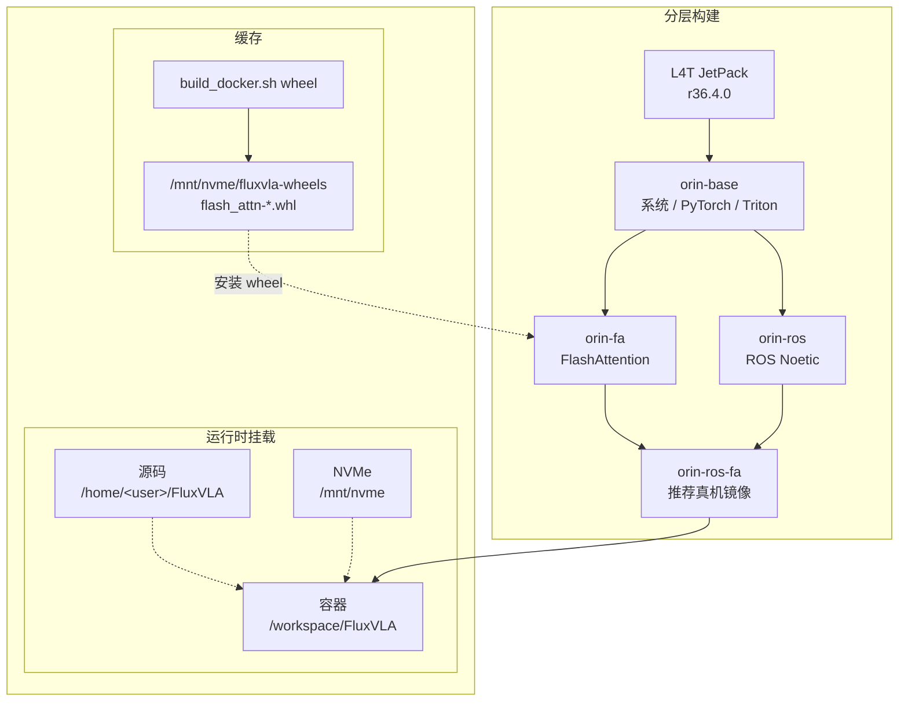

# Jetson Orin Docker 与运行测试指南

## 1. 推荐路线

推荐把 Orin 宿主机当作稳定运行底座：宿主机负责 JetPack、Docker、NVMe、源码和模型数据；FluxVLA 的 Python、PyTorch、Triton、FlashAttention、ROS Noetic 运行环境优先放在 Docker 镜像内。

推荐源码路径：

```bash
/home/<user>/FluxVLA
```

推荐数据和模型路径：

```bash
/mnt/nvme
```

当前统一由一个入口管理 Docker 构建：

```bash
docker/build_docker.sh
```

默认构建推荐的新分层镜像：

- `fluxvla:orin-base`  w/o flash attention & ros1
- `fluxvla:orin-fa`  with flash attention
- `fluxvla:orin-ros`  with ros1-noetic
- `fluxvla:orin-ros-fa`
  避免 FlashAttention 和 ROS 每次一起重编。

真机推理优先使用：

```text
fluxvla:orin-ros-fa
```

只做非 ROS 的推理或测速 benchmark 时可以使用：

```text
fluxvla:orin-fa
```

## 2. 宿主机前置检查

进入 Orin 后先确认系统、NVMe 和 Docker 状态：

```bash
cat /etc/nv_tegra_release
nvcc --version
df -h /mnt/nvme
docker --version
docker info | grep -i runtime || true
docker ps
```

如果 `docker ps` 需要 `sudo`，先修 Docker 用户权限：

```bash
sudo usermod -aG docker "$USER"
newgrp docker
docker ps
```

Docker image store 建议放到 NVMe，避免系统盘被镜像层占满：

```bash
docker info | grep "Docker Root Dir"
```

如果仍是 `/var/lib/docker`，可在第一次大规模 build 前迁移：

```bash
sudo apt update
sudo apt install -y rsync
sudo systemctl stop docker
sudo mkdir -p /mnt/nvme/docker
# sudo apt install rsync
sudo rsync -aHAX /var/lib/docker/ /mnt/nvme/docker/

sudo mkdir -p /etc/docker
sudo tee /etc/docker/daemon.json <<'EOF'
{
  "data-root": "/mnt/nvme/docker"
}
EOF

sudo systemctl start docker
docker info | grep "Docker Root Dir"
```

期望输出：

```text
Docker Root Dir: /mnt/nvme/docker
```

## 3. 构建镜像

所有命令默认在仓库根目录执行：

```bash
cd /home/<user>/FluxVLA
```

推荐只使用一个统一入口：

```bash
docker/build_docker.sh
```

默认 target 是 `all`，分层构建 `base -> flash-attn wheel -> fa -> ros -> ros-fa`。ROS 层默认使用国内镜像源；如果不想使用国内源，可显式设置 `FLUXVLA_USE_CN_MIRRORS=0`。

构建产物：

```text
fluxvla:orin-base
fluxvla:orin-ros-fa
```

FlashAttention wheel 默认写到：

```text
/mnt/nvme/fluxvla-wheels
```

> 若需要重新编译 FlashAttention SM87 wheel：

```bash
docker/build_docker.sh wheel
docker/build_docker.sh fa
docker/build_docker.sh ros-fa
```

> 若需要重新编译 ROS 层：

```bash
docker/build_docker.sh ros
docker/build_docker.sh ros-fa
```

FluxVLA 源码跟随：
无需重新重新编译镜像和容器， `docker/run_docker.sh` bind mount 当前源码到 `/workspace/FluxVLA`。修改 Orin 本地源码（如：/workspace/FluxVLA）即可同步修改容器内源码。

分层关系如下：



查看完整帮助：

```bash
docker/build_docker.sh --help
```

## 4. 进入容器

统一使用仓库脚本：

```bash
cd /home/<user>/FluxVLA
docker/run_docker.sh
```

指定镜像：

```bash
FLUXVLA_IMAGE=fluxvla:orin-ros-fa docker/run_docker.sh
```

直接执行容器内命令：

```bash
FLUXVLA_IMAGE=fluxvla:orin-ros-fa docker/run_docker.sh \
  python3 -c "import torch; print(torch.cuda.is_available(), torch.version.cuda)"
```

`docker/run_docker.sh` 会统一补齐运行参数、环境变量和常用挂载：

| 类别              | 自动处理内容                                                                                                                                 |
| ----------------- | -------------------------------------------------------------------------------------------------------------------------------------------- |
| Docker 运行参数   | --runtime=nvidia、--network=host、--ipc=host、--shm-size=16g                                                                                 |
| Python / 推理环境 | PYTHONPATH=/workspace/FluxVLA、WANDB_MODE=disabled                                                                                           |
| Attention 配置    | ATTN_IMPLEMENTATION 默认 flash_attention_2；TRANSFORMERS_ATTN_IMPLEMENTATION 默认跟随 ATTN_IMPLEMENTATION                                    |
| 目录挂载          | 仓库根目录挂到 /workspace/FluxVLA；                                                                                                          |
| Robotiq 消息包    | 自动探测 `~/robotiq_pkg/robotiq`；也可用 `ROBOTIQ_PY_PKG=/path/to/robotiq` 指定，挂到 `/opt/ros/noetic/lib/python3/dist-packages/robotiq:ro` |
| ROS 网络变量      | 若宿主机设置了 ROS_MASTER_URI、ROS_IP 或 ROS_HOSTNAME，自动透传到容器                                                                        |

临时回退 eager attention：

```bash
ATTN_IMPLEMENTATION=eager TRANSFORMERS_ATTN_IMPLEMENTATION=eager \
  FLUXVLA_IMAGE=fluxvla:orin-ros-fa docker/run_docker.sh
```

确认宿主机代码是否真的挂进容器：

```bash
# 宿主机
cd /home/<user>/FluxVLA
echo "MARK_$(date +%s)" > _mount_probe.txt
cat _mount_probe.txt

# 容器内
cat /workspace/FluxVLA/_mount_probe.txt
```

内容一致说明当前编辑的源码就是容器正在挂载的源码。验证后删除：

```bash
rm -f _mount_probe.txt /workspace/FluxVLA/_mount_probe.txt
```

## 5. 基础验收测试

### 5.1 镜像与容器基础状态

```bash
cd /home/<user>/FluxVLA
docker images fluxvla

FLUXVLA_IMAGE=fluxvla:orin-ros-fa docker/run_docker.sh \
  bash -lc 'pwd; python3 --version; echo "$PYTHONPATH"; ls /mnt/nvme >/dev/null && echo NVME_OK'
```

### 5.2 PyTorch / CUDA

```bash
FLUXVLA_IMAGE=fluxvla:orin-ros-fa docker/run_docker.sh python3 - <<'PY'
import torch
print('torch:', torch.__version__)
print('cuda_available:', torch.cuda.is_available())
print('torch_cuda:', torch.version.cuda)
if torch.cuda.is_available():
    print('device:', torch.cuda.get_device_name(0))
PY
```

通过标准：`cuda_available: True`，设备显示 Orin GPU。

### 5.3 Triton / FlashAttention / FluxVLA

```bash
FLUXVLA_IMAGE=fluxvla:orin-ros-fa docker/run_docker.sh python3 - <<'PY'
import triton
print('triton:', triton.__version__)

import flash_attn
print('flash_attn:', flash_attn.__version__)

import fluxvla
print('fluxvla: OK')
PY
```

如果只跑 `fluxvla:orin-base` 或不带 FA 的镜像，`flash_attn` 失败是预期现象；此时使用 `ATTN_IMPLEMENTATION=eager` 跑基础链路。

### 5.4 ROS Python 环境

```bash
FLUXVLA_IMAGE=fluxvla:orin-ros-fa docker/run_docker.sh \
  python3 -c "import rospy, cv_bridge; print('ROS PY OK')"
```

验证 robotiq 自定义消息包：

```bash
FLUXVLA_IMAGE=fluxvla:orin-ros-fa docker/run_docker.sh \
  bash -lc 'source /opt/ros/noetic/setup.bash && python3 -c "from robotiq.msg import StampedFloat32; print(StampedFloat32._type)"'
```

通过标准：输出 `robotiq/StampedFloat32`。

### 5.5 GR00T checkpoint test

先确认 checkpoint 文件本身可被 `torch.load` 读取：

```bash
CKPT=.../gr00t_eagle_3b_ur3_full_finetune_orin/checkpoints/step-000100-epoch-00-loss=1.2629.pt

FLUXVLA_IMAGE=fluxvla:orin-ros-fa docker/run_docker.sh \
  python3 - <<PY
import torch
p = '${CKPT}'
obj = torch.load(p, map_location='cpu')
print(type(obj).__name__)
print(sorted(obj.keys())[:20] if isinstance(obj, dict) else 'non-dict')
PY
```

再跑一次短推理：

```bash
FLUXVLA_IMAGE=fluxvla:orin-ros-fa docker/run_docker.sh \
  python3 scripts/test_gr00t_with_embodiment.py \
    --config configs/gr00t/gr00t_eagle_3b_ur3_full_finetune.py \
    --ckpt "$CKPT" \
    --warmup 0 \
    --predict-runs 1
```

通过标准：`predict_action output shape` 出现，命令正常退出。

### 5.6 GR00T baseline / accelerated 100 次测速 benchmark

该测速用同一个 benchmark 脚本分别测试 baseline 和 accelerated :

| variant     | 配置来源              | 组件路径                                             | 说明                         |
| ----------- | --------------------- | ---------------------------------------------------- | ---------------------------- |
| baseline    | `cfg.model`           | `EagleBackbone + FlowMatchingHead`                   | 普通推理路径，用作对照       |
| accelerated | `cfg.inference_model` | `EagleInferenceBackbone + FlowMatchingInferenceHead` | Triton / CUDA Graph 加速路径 |

先设置相同 checkpoint：

```bash
CKPT=../gr00t_eagle_3b_ur3_full_finetune_orin/checkpoints/step-006000-epoch-00-loss=0.1157.safetensors
```

baseline：

```bash
FLUXVLA_IMAGE=fluxvla:orin-ros-fa docker/run_docker.sh \
  python3 test/test_models/test_gr00t_orin.py \
    --variant baseline \
    --config configs/gr00t/gr00t_eagle_3b_ur3_full_finetune.py \
    --ckpt "$CKPT" \
    --warmup 5 \
    --predict-runs 100
```

accelerated：

```bash
FLUXVLA_IMAGE=fluxvla:orin-ros-fa docker/run_docker.sh \
  python3 test/test_models/test_gr00t_orin.py \
    --variant accelerated \
    --config configs/gr00t/gr00t_eagle_3b_ur3_full_finetune.py \
    --ckpt "$CKPT" \
    --warmup 5 \
    --predict-runs 100
```

期望关键信息：

```text
Head: FlowMatchingInferenceHead
Backbone: EagleInferenceBackbone
image_token_id=151669, image_token_count=512
predict_action output shape: (1, 32, 7)
latency_ms: ... median= 190 ms ...
OK
```

`image_token_count=512` 表示 2 路图像各 256 个 image tokens 已经放入 `lang_tokens`，视觉 embedding 会插入到 language sequence 中参与后续 attention。若该值为 0，说明测速输入不含 image tokens，结果不能代表真实图文推理路径。

记录结果时建议使用下表：

| variant           | median latency | frequency |
| ----------------- | -------------- | --------- |
| GR00T-baseline    | 256 ms         | 3.9 Hz    |
| GR00T-accelerated | 190 ms         | 5.26 Hz   |

## 7. 问题与排障记录

近期调试结论、checkpoint 转换建议、Q&A、最小验收清单和来源文档已拆分到独立文档：

```text
docs/orin_docker_runtime_issue_zh-CN.md
```
