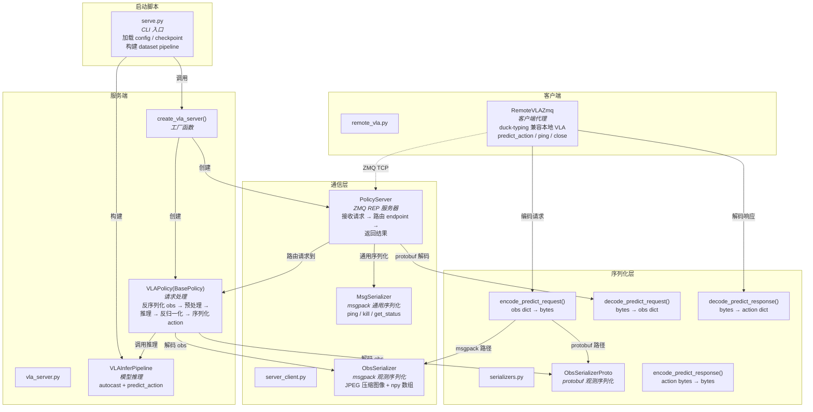
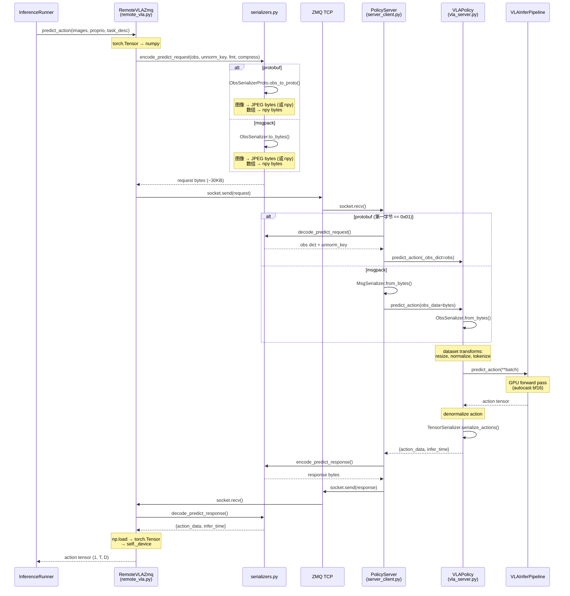

# FluxVLA Remote 模块架构

## 文件概览

| 文件               | 职责                                                         | 角色       |
| ------------------ | ------------------------------------------------------------ | ---------- |
| `serve.py`         | CLI 入口，加载模型/配置，启动服务器                          | 启动脚本   |
| `vla_server.py`    | 模型推理流水线 + 策略包装 + 服务器工厂                       | 服务端核心 |
| `server_client.py` | ZMQ 通信框架（PolicyServer / ObsSerializer / MsgSerializer） | 通信层     |
| `serializers.py`   | protobuf / msgpack 双格式编解码                              | 序列化层   |
| `remote_vla.py`    | 客户端代理，伪装成本地 VLA 模型                              | 客户端核心 |

## 调用关系



## 数据流：一次 predict_action 请求



## 文件命名与职责对照

### 当前命名的困惑点

| 困惑                                                        | 原因                                                        |
| ----------------------------------------------------------- | ----------------------------------------------------------- |
| `serve.py` vs `vla_server.py`                               | 都像"服务端"，但一个是 CLI 入口，一个是业务逻辑             |
| `server_client.py`                                          | 名字暗示同时包含 server 和 client，实际主要是 server 通信层 |
| `serializers.py` vs `server_client.py` 中的 `ObsSerializer` | 两个文件都有序列化逻辑，职责重叠                            |
| `remote_vla.py`                                             | 名字不够直观，实际是"客户端代理"                            |

### 各文件的实际定位

```
fluxvla/remote/
├── serve.py            # 入口脚本（等价于 main.py）
│                       # 解析 CLI 参数 → 加载模型 → 构建 pipeline → 启动 server
│
├── vla_server.py       # 服务端业务逻辑
│                       # VLAInferPipeline: 模型推理封装
│                       # VLAPolicy: obs 解码 → 预处理 → 推理 → 反归一化
│                       # create_vla_server(): 工厂函数
│
├── server_client.py    # ZMQ 通信框架（与业务无关的通用层）
│                       # PolicyServer: ZMQ REP 事件循环 + endpoint 路由
│                       # MsgSerializer: msgpack 通用序列化
│                       # ObsSerializer: msgpack 观测序列化（JPEG + npy）
│
├── serializers.py      # 双格式序列化（protobuf + msgpack 的统一入口）
│                       # ObsSerializerProto: protobuf 观测序列化
│                       # encode/decode_predict_request/response
│                       # 格式自动检测（第一字节 0x01 = protobuf）
│
├── remote_vla.py       # 客户端代理（伪装成本地 VLA 模型）
│                       # RemoteVLAZmq: predict_action → ZMQ → server
│                       # duck-typing: eval/cuda/freeze_* 兼容 runner
│
└── proto/
    ├── vla_service.proto    # protobuf schema 定义
    └── vla_service_pb2.py   # protoc 生成的 Python 代码
```
